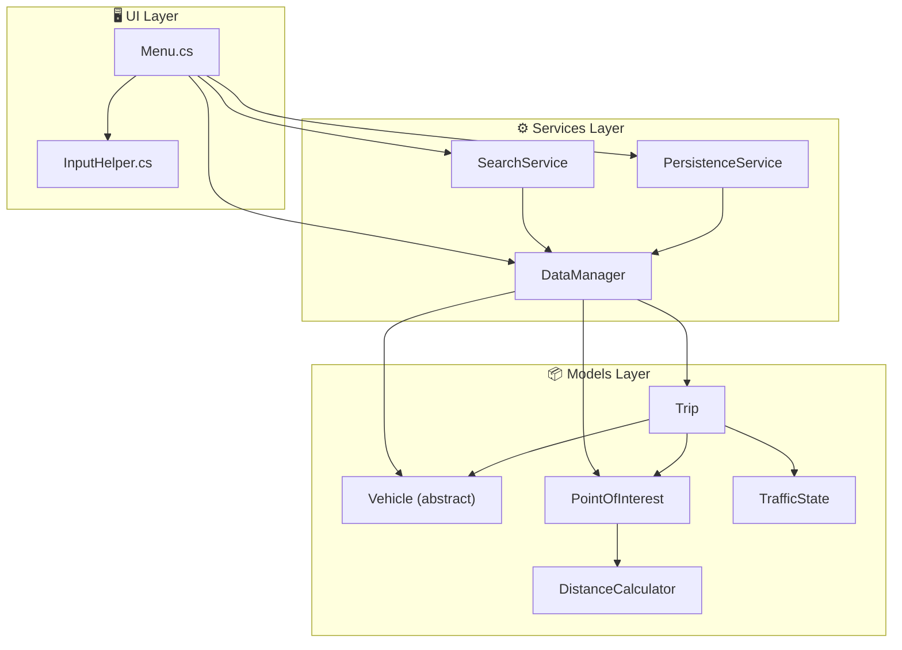
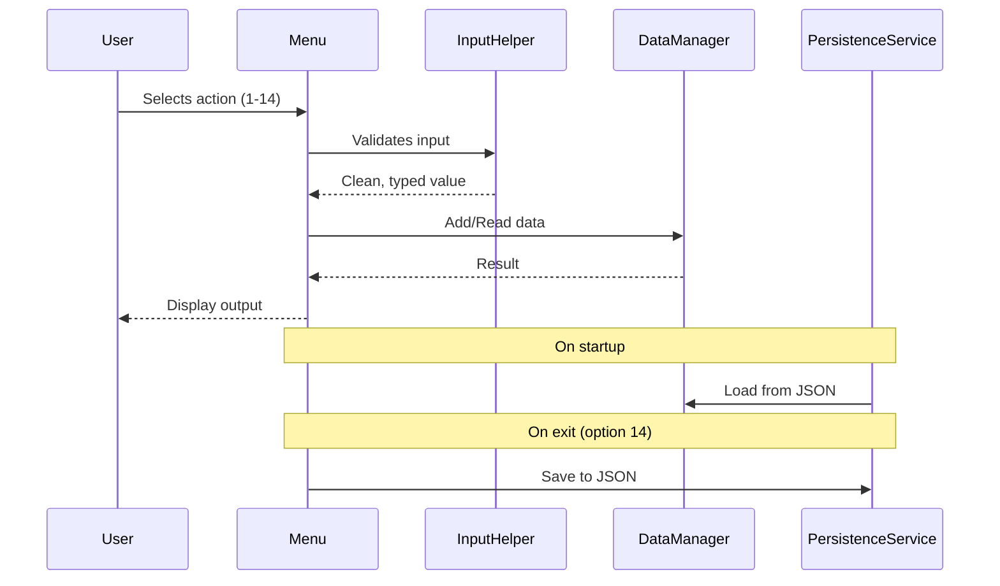
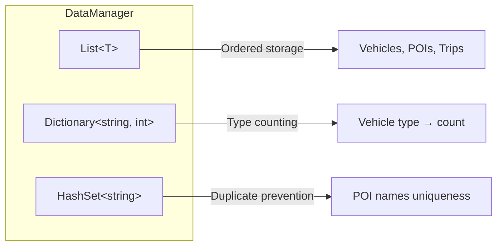

# 🏗️ Architecture

## Overview

The project follows a **3-layer architecture** that separates concerns cleanly:

---

## Layer Responsibilities

|    Layer     | Role                                              | Files                                                         |
| :----------: | ------------------------------------------------- | ------------------------------------------------------------- |
|    **UI**    | User interaction, input validation, display       | `Menu.cs`, `InputHelper.cs`                                   |
| **Services** | Business logic, data storage, search, persistence | `DataManager.cs`, `SearchService.cs`, `PersistenceService.cs` |
|  **Models**  | Domain entities, interfaces, enums, calculations  | All model classes                                             |

---

## Data Flow

---

## Design Patterns Used

| Pattern                   | Where                                 | Why                                                                        |
| ------------------------- | ------------------------------------- | -------------------------------------------------------------------------- |
| **Abstract Class**        | `Vehicle`                             | Force subclasses to implement `GetVehicleType()` and `GetDetailedStatus()` |
| **Interface Segregation** | `IThermalCar`, `IElectricCar`         | `HybridCar` composes both capabilities                                     |
| **DTO Pattern**           | `PersistenceService`                  | Clean serialization without exposing domain internals                      |
| **Service Layer**         | `SearchService`, `PersistenceService` | Isolate logic from UI                                                      |
| **Input Sanitization**    | `InputHelper`                         | Centralized validation with retry loops                                    |

---

## Collection Strategy

|        Collection         | Purpose                                        |
| :-----------------------: | ---------------------------------------------- |
|      `List<Vehicle>`      | Ordered, indexed access to vehicles            |
|  `List<PointOfInterest>`  | Ordered, indexed access to POIs                |
|       `List<Trip>`        | Ordered trip history                           |
| `Dictionary<string, int>` | Vehicle count per type (Car, Truck, HybridCar) |
|     `HashSet<string>`     | Prevents duplicate POI names                   |

---

  <a href="../README.md">← Back to Main README</a>

