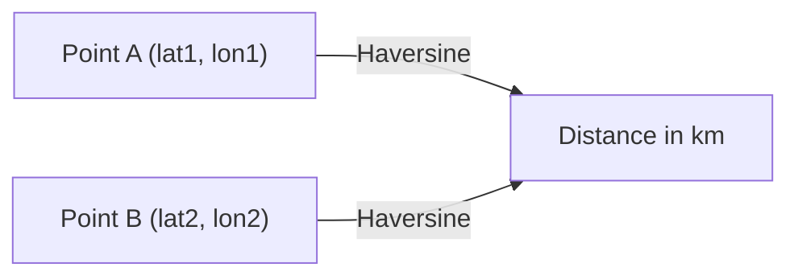
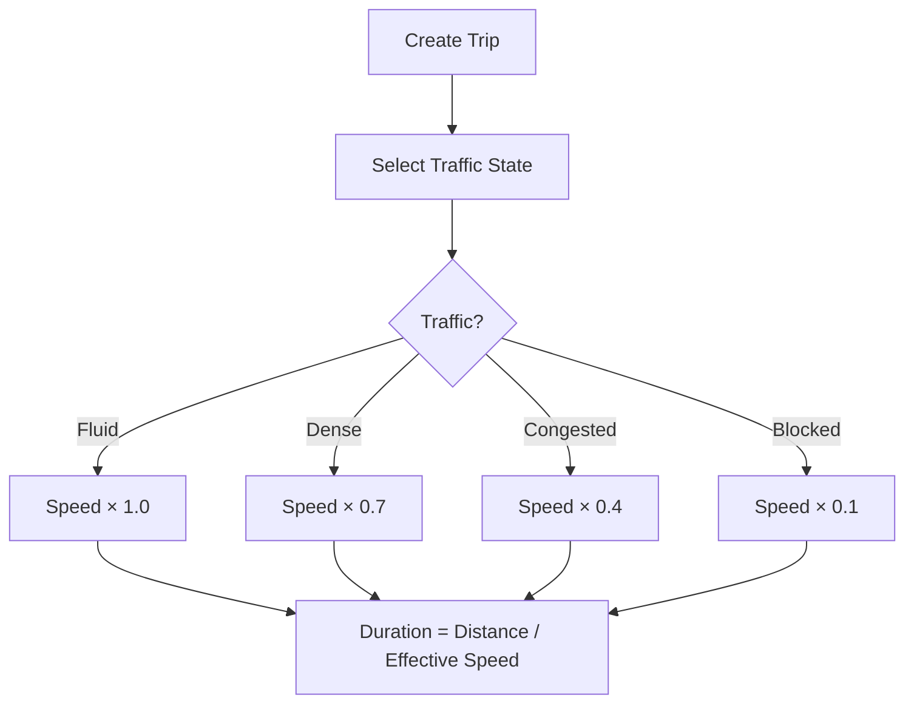
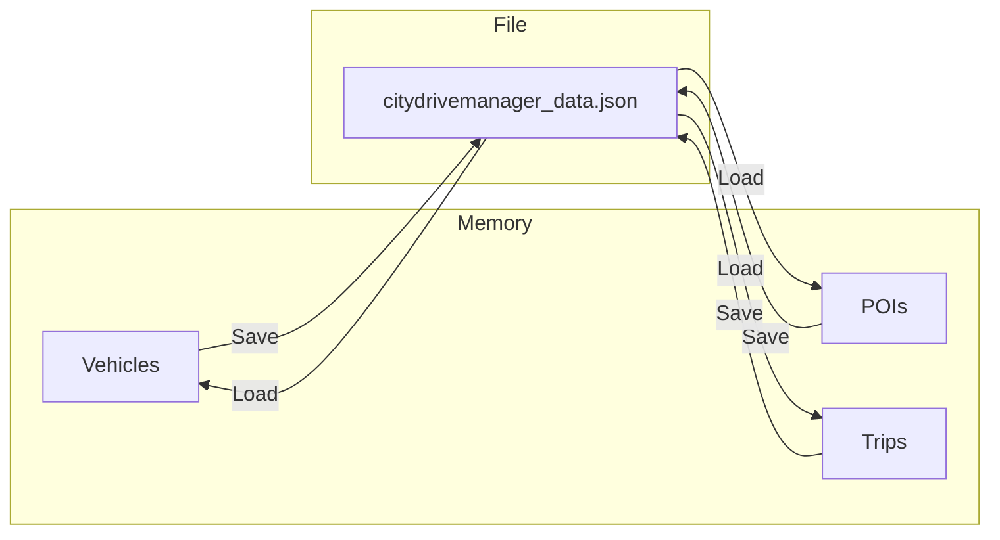
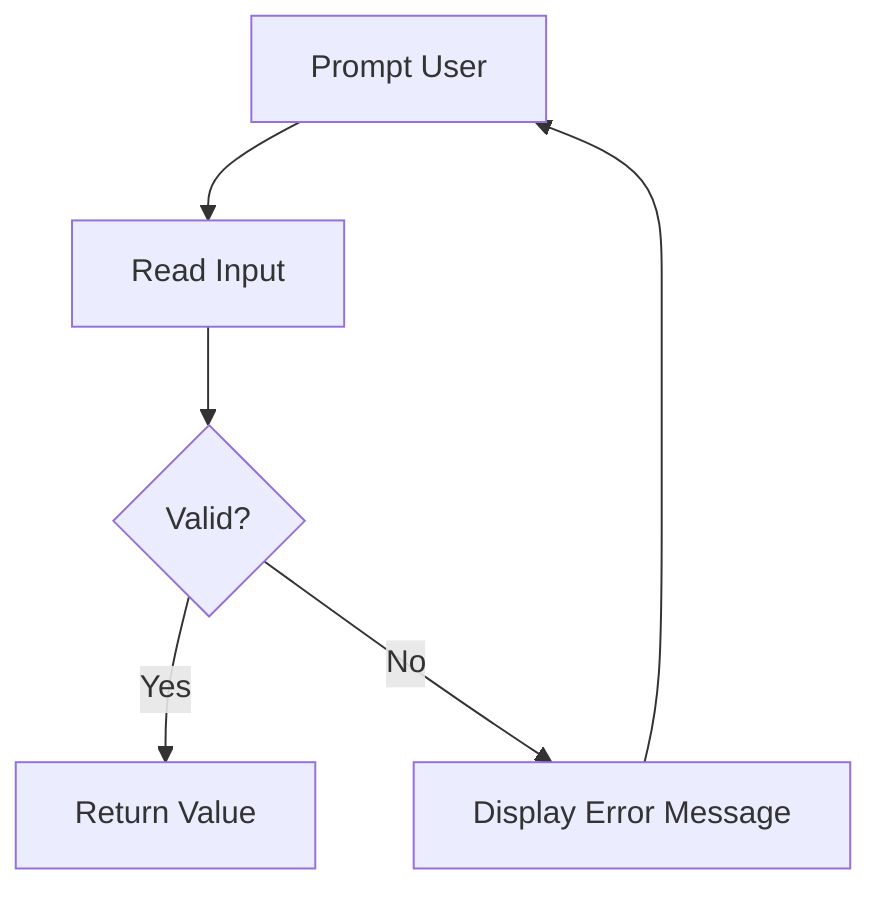

# ✨ Features

## Base Features

### 1. Vehicle Management

Add and manage three types of vehicles:

| Type          | Properties                  | Special Behavior                 |
| ------------- | --------------------------- | -------------------------------- |
| **Car**       | Brand, Color, Model         | Standard acceleration (+10 km/h) |
| **Truck**     | Brand, Color, Tonnage       | Standard acceleration (+10 km/h) |
| **HybridCar** | Brand, Color, Battery, Fuel | Battery priority → then fuel     |

### 2. Points of Interest

Register geographic locations with automatic Google Maps URLs:

| Type                   | Extra Property | Example URL                                    |
| ---------------------- | -------------- | ---------------------------------------------- |
| **Campus**             | Capacity       | `https://www.google.com/maps?q=48.8566,2.3522` |
| **HistoricalMonument** | Build Year     | Same format                                    |

### 3. Trip Planning

Create trips between POIs with a selected vehicle:

- Distance calculated via **Haversine** formula
- Duration based on average speed of **50 km/h** (traffic-adjusted)

### 4. Physics Simulation

Accelerate and brake vehicles interactively:

- **Accelerate**: +10 km/h per call
- **Brake**: -10 km/h (minimum 0, never negative)

### 5. Data Sanitization

All string inputs are automatically:

- `Trim()` — removes leading/trailing whitespace
- `ToUpper()` — converted to uppercase

---

## Bonus Features

### 🌍 Haversine Distance (Realistic)

> **File:** `Models/DistanceCalculator.cs`

Replaces the simplified Euclidean formula with the **Haversine formula** for realistic geographic distance:



The menu option **5. Calculate a distance** now shows **both** distances for comparison:

```
Distance between PARIS and LYON:
  Haversine (realistic): 392.21 km
  Euclidean (simplified): 3.80 units
```

---

### 🚦 Traffic Simulation System

> **Files:** `Models/TrafficState.cs`, `Models/Trip.cs`

A `TrafficState` enum dynamically adjusts the effective travel speed:

|    State     | Speed Multiplier | Effective Speed |
| :----------: | :--------------: | :-------------: |
|   🟢 Fluid   |       ×1.0       |     50 km/h     |
|   🟡 Dense   |       ×0.7       |     35 km/h     |
| 🟠 Congested |       ×0.4       |     20 km/h     |
|  🔴 Blocked  |       ×0.1       |     5 km/h      |



---

### 💾 JSON Persistence (Save & Load)

> **File:** `Services/PersistenceService.cs`

All data is saved to `citydrivemanager_data.json`:

- **Auto-load** on application startup
- **Auto-save** on exit (option 14)
- **Manual save** via option 13



---

### 🔍 Advanced Search & Filtering

> **File:** `Services/SearchService.cs`

#### Vehicle Search (Menu option 9)

| Filter         | Input                         | Example                  |
| -------------- | ----------------------------- | ------------------------ |
| By type        | `Car` / `Truck` / `HybridCar` | All trucks               |
| By brand       | Partial text                  | All `RENAULT` vehicles   |
| By min speed   | Integer                       | Vehicles ≥ 30 km/h       |
| By min battery | Percentage                    | HybridCars ≥ 50% battery |
| By min fuel    | Liters                        | HybridCars ≥ 10L fuel    |

#### Place Search (Menu option 10)

| Filter          | Input          | Example                             |
| --------------- | -------------- | ----------------------------------- |
| By name         | Partial text   | All places containing `CAMPUS`      |
| Nearby (radius) | Reference + km | POIs within 50 km of selected point |

---

### 🛡️ Robust Error Handling

> **File:** `UI/InputHelper.cs`

Every user input is validated with a **retry loop** — the application never crashes:



| Method                       | Validates                     |
| ---------------------------- | ----------------------------- |
| `ReadString(prompt)`         | Non-empty, trimmed, uppercase |
| `ReadInt(prompt)`            | Valid integer                 |
| `ReadInt(prompt, min, max)`  | Integer within range          |
| `ReadDouble(prompt)`         | Valid decimal                 |
| `ReadPositiveDouble(prompt)` | Non-negative decimal          |
| `ReadDateTime(prompt)`       | Valid date/time               |

All menu actions are wrapped in `try/catch` for exception safety.

---

### 🏛️ Layered Architecture

The code is cleanly separated into three layers:

|    Layer     | Responsibility           | Dependencies |
| :----------: | ------------------------ | :----------: |
|    **UI**    | Input / Output / Display |  → Services  |
| **Services** | Logic / Storage / Search |   → Models   |
|  **Models**  | Entities / Calculations  |     None     |

> See [Architecture Documentation](architecture.md) for full diagrams.

---

### 🔷 Advanced Polymorphism

`Vehicle` defines two **abstract methods** that every subclass must implement:

```csharp
public abstract string GetVehicleType();
public abstract string GetDetailedStatus();
```

This enables:

- **SearchService** to filter by type without `is` / `typeof` checks
- **Menu** to display type-specific status via a single polymorphic call
- **DataManager** to count vehicles by type using the returned string

---

<p align="center">
  <a href="../README.md">← Back to Main README</a>
</p>
