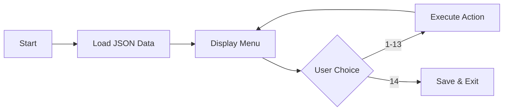

# 🚀 Getting Started

## Prerequisites

| Requirement |         Version         |
| :---------: | :---------------------: |
|  .NET SDK   |        **10.0+**        |
|     OS      | Windows / macOS / Linux |

---

## Installation

```bash
# 1. Clone the repository
git clone https://github.com/guiiireg/CityDrive-Manager.git

# 2. Navigate to the project
cd CityDrive-Manager
```


---

## Running the Application

```bash
dotnet run --project CityDriveManager.csproj
```

On first launch, the application will look for a `citydrivemanager_data.json` file. If none exists, it starts with empty data.

---

## Interactive Menu

Once running, you'll see the main menu:

```
==============================
CITY DRIVE MANAGER - SMART CITY
==============================
 1. Add a point of interest
 2. Add a vehicle
 3. Display vehicles
 4. Display places
 5. Calculate a distance
 6. Simulate acceleration / braking
 7. Create a trip
 8. Display trips
 9. Search vehicles
10. Search places
11. Manage fuel / battery
12. Vehicle summary
13. Save data
14. Quit
Choice:
```

---

## Usage Flow



> All user inputs are automatically **trimmed** and converted to **uppercase**.  
> Invalid inputs trigger clear error messages and **retry loops** — the application never crashes.

---

## Build Only

If you just want to compile without running:

```bash
dotnet build CityDriveManager.csproj
```

---

<p align="center">
  <a href="../README.md">← Back to Main README</a>
</p>
