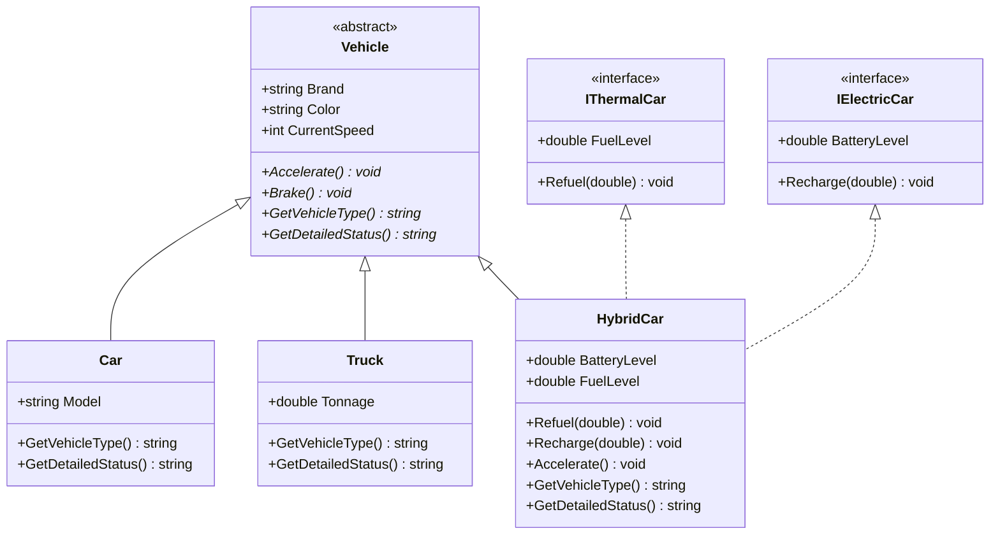
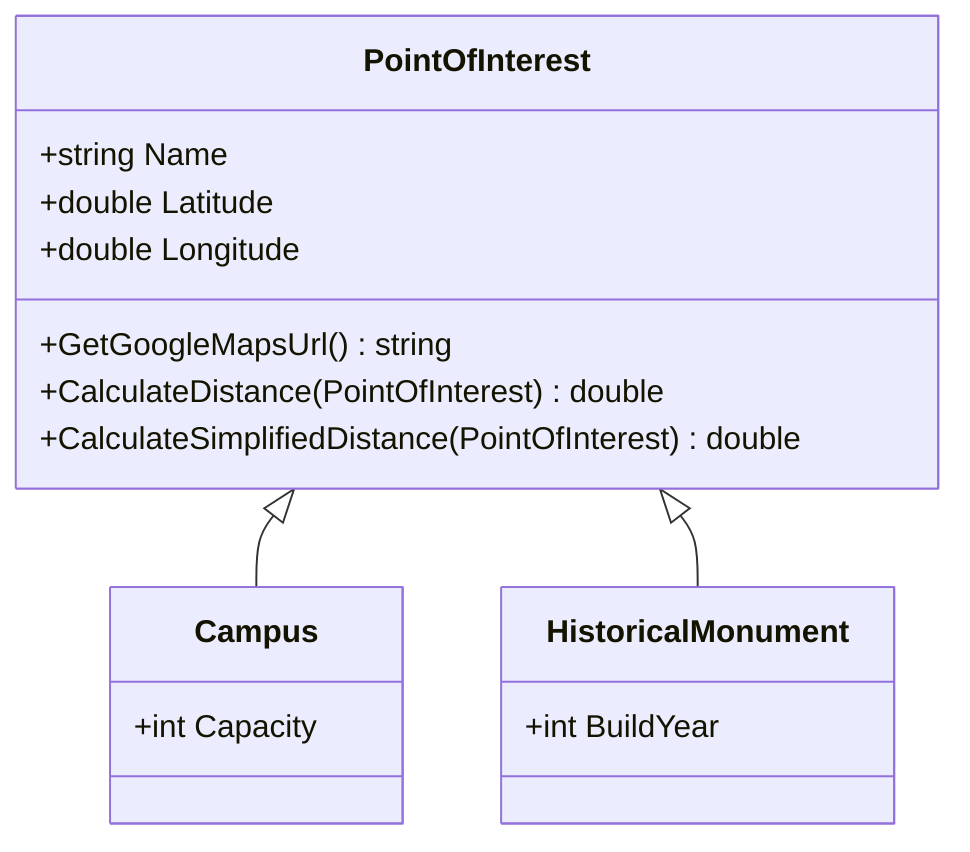
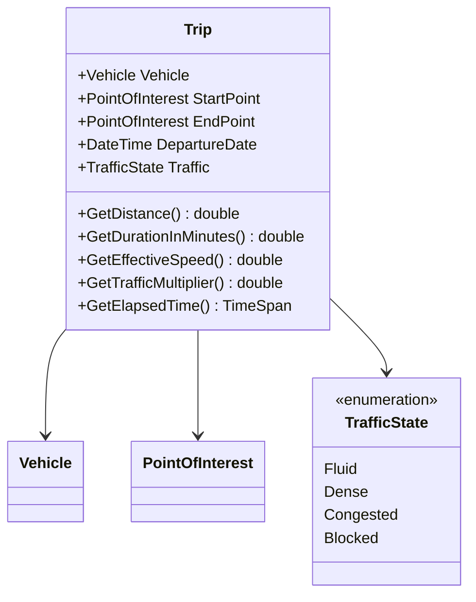
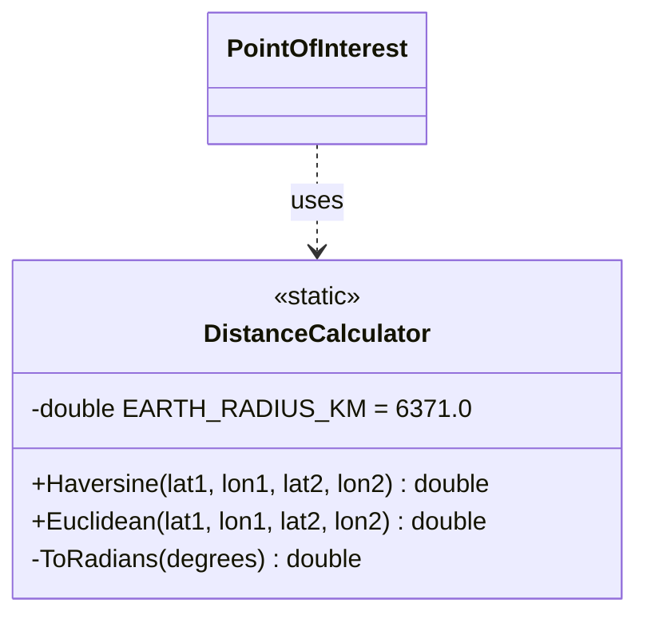
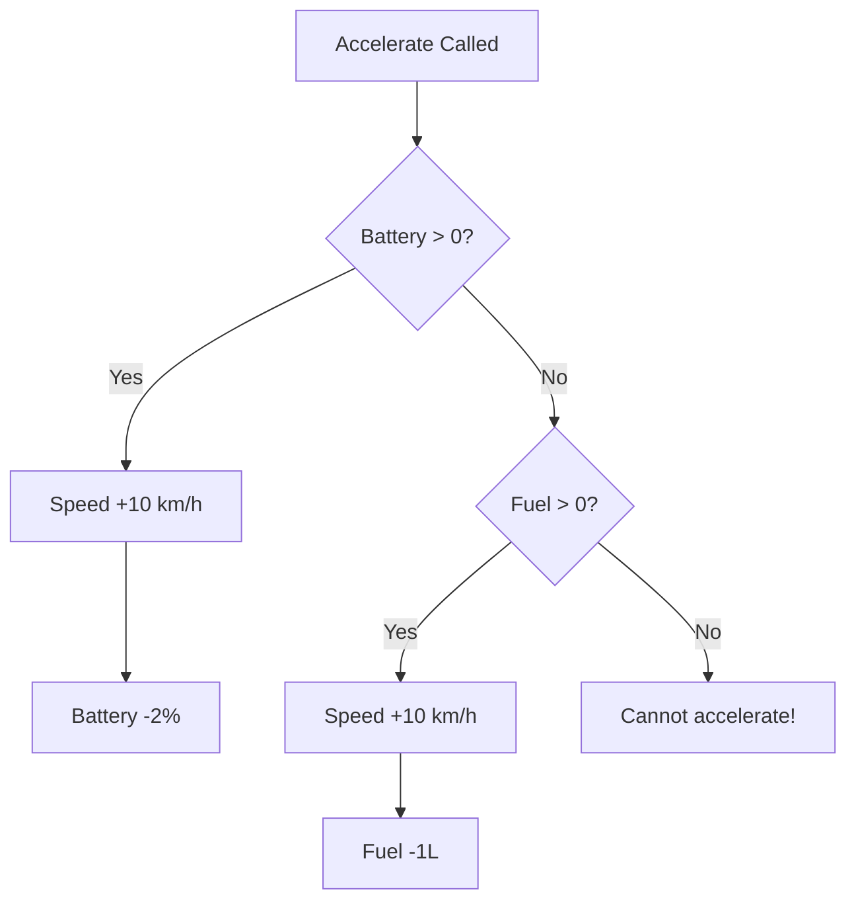

# 📦 Models

## Class Hierarchy



---

## Points of Interest Hierarchy



---

## Trip & Traffic



---

## Distance Calculator



### Haversine Formula

The Haversine formula calculates the great-circle distance between two points on a sphere:

```
a = sin²(Δlat/2) + cos(lat1) · cos(lat2) · sin²(Δlon/2)
c = 2 · atan2(√a, √(1−a))
d = R · c
```

Where **R = 6,371 km** (Earth's radius).

---

## Polymorphism in Action

The `Vehicle` class defines two **abstract methods** that each subclass must override:

| Method                | Car                 | Truck                 | HybridCar                                  |
| --------------------- | ------------------- | --------------------- | ------------------------------------------ |
| `GetVehicleType()`    | `"Car"`             | `"Truck"`             | `"HybridCar"`                              |
| `GetDetailedStatus()` | Shows brand + model | Shows brand + tonnage | Shows brand + battery + fuel + energy mode |

This allows the `SearchService` and `Menu` to call these methods polymorphically without type checking.

---

## HybridCar Energy Logic



---

<p align="center">
  <a href="../README.md">← Back to Main README</a>
</p>
