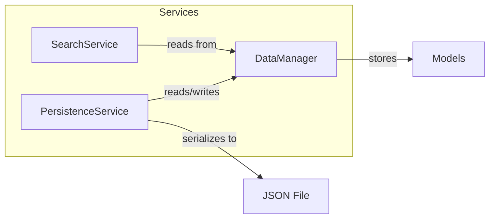
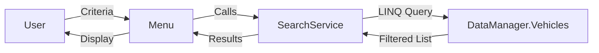
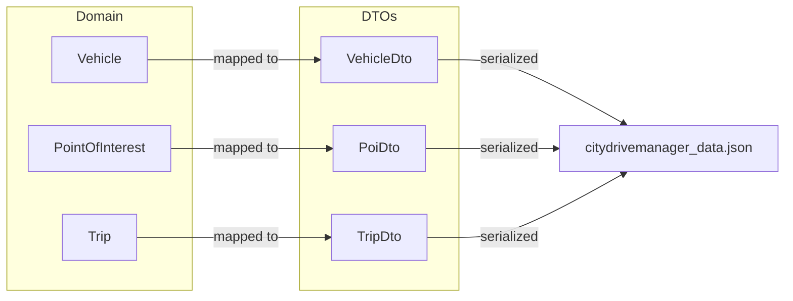
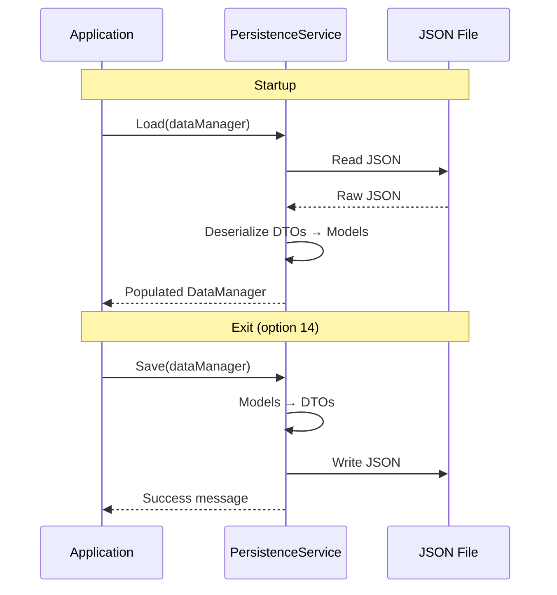

# ⚙️ Services

## Overview

The services layer sits between the UI and the models, handling all business logic, data storage, search, and persistence.



---

## DataManager

> **File:** `Services/DataManager.cs`

Central data repository using three collection types:

### Collections Used

|        Collection         | Field               | Purpose                     |
| :-----------------------: | ------------------- | --------------------------- |
|      `List<Vehicle>`      | `Vehicles`          | Ordered vehicle storage     |
|  `List<PointOfInterest>`  | `PointsOfInterest`  | Ordered POI storage         |
|       `List<Trip>`        | `Trips`             | Ordered trip history        |
| `Dictionary<string, int>` | `VehicleTypeCounts` | Count per vehicle type      |
|     `HashSet<string>`     | `PoiNames`          | Prevent duplicate POI names |

### Key Methods

| Method                    | Returns | Description                                  |
| ------------------------- | ------- | -------------------------------------------- |
| `AddPointOfInterest(poi)` | `bool`  | Adds POI if name is unique (HashSet check)   |
| `AddVehicle(vehicle)`     | `void`  | Adds vehicle + updates type count dictionary |
| `AddTrip(trip)`           | `void`  | Adds trip to the list                        |
| `DisplayVehicleSummary()` | `void`  | Prints vehicle count per type                |

---

## SearchService

> **File:** `Services/SearchService.cs`

LINQ-powered search and filtering engine.

### Vehicle Search

| Method                      | Parameter | Filter Logic                            |
| --------------------------- | --------- | --------------------------------------- |
| `SearchByType(type)`        | `string`  | Exact match on `GetVehicleType()`       |
| `SearchByBrand(brand)`      | `string`  | Partial match, case-insensitive         |
| `FilterByMinSpeed(speed)`   | `int`     | `CurrentSpeed >= speed`                 |
| `FilterByMaxSpeed(speed)`   | `int`     | `CurrentSpeed <= speed`                 |
| `FilterByMinBattery(level)` | `double`  | HybridCar only, `BatteryLevel >= level` |
| `FilterByMinFuel(level)`    | `double`  | HybridCar only, `FuelLevel >= level`    |

### POI Search

| Method                    | Parameter     | Filter Logic                     |
| ------------------------- | ------------- | -------------------------------- |
| `SearchPoiByName(name)`   | `string`      | Partial match, case-insensitive  |
| `FindNearby(ref, radius)` | `POI, double` | Haversine distance ≤ radius (km) |

### Search Flow



---

## PersistenceService

> **File:** `Services/PersistenceService.cs`

Handles JSON serialization/deserialization of the entire data graph.

### Architecture

Uses **DTO (Data Transfer Object)** classes to decouple serialization from domain models:



### Save/Load Lifecycle



### Trip References

Trips reference vehicles and POIs **by index** in the JSON file, since they hold object references in memory:

```json
{
  "VehicleIndex": 0,
  "StartPointIndex": 1,
  "EndPointIndex": 2,
  "DepartureDate": "2025-06-15T14:30:00",
  "Traffic": "Dense"
}
```

On load, indices are resolved back to the actual objects in the reconstructed lists.

---

<p align="center">
  <a href="../README.md">← Back to Main README</a>
</p>
